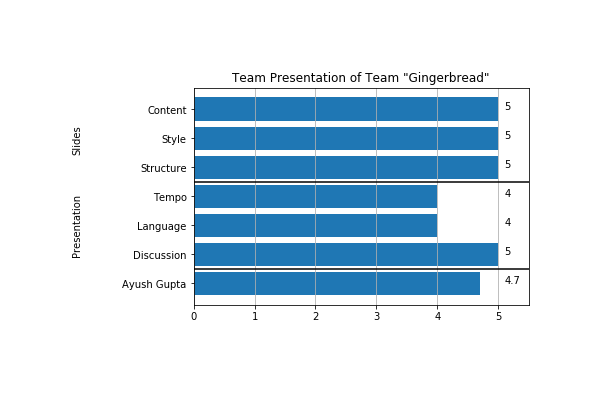
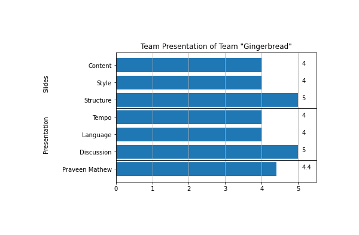
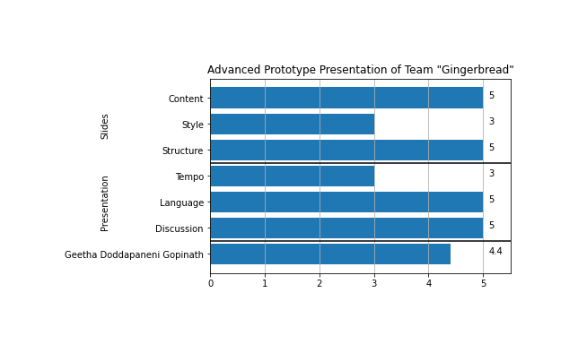
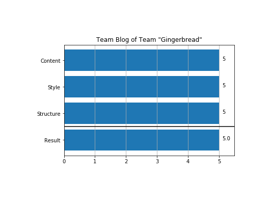
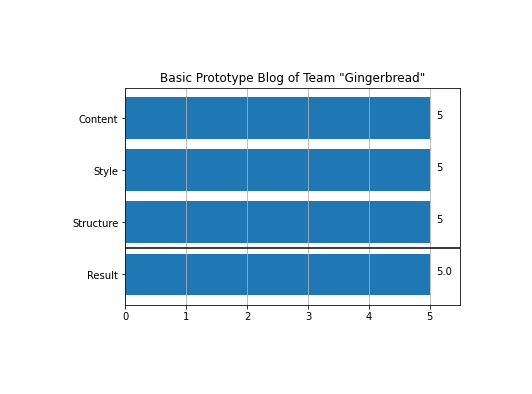
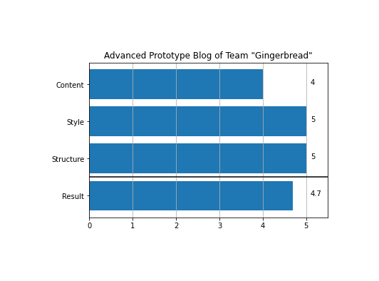
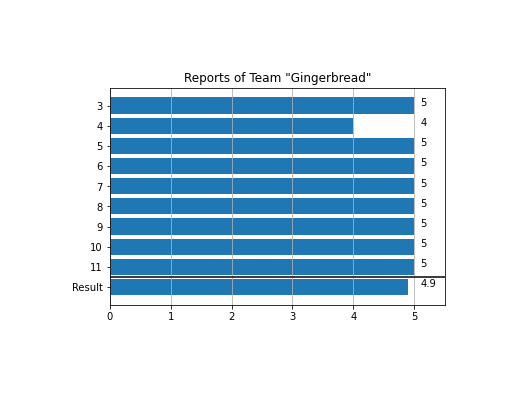

# Results of Deliverables

## Presentations

Each presentation will have a result file linked in this document, which shows the resulting grades of the presentation. The presentation has 6 seperate grading categories. These categories fall in three topics:

* Slides
* Presentation (Main Presenter)
* Presentation (Support Presenters)

### Slide Categories

Slides are graded regarding their completeness regarding *Content* and  their quality regarding *Style* and *Structure*.

* *Content* depends on the individual presentation
* *Structure* graded how well follow a basic  order that helps the audience understand the points, which are conveyed by the presenter.
* *Style* grades the quality of the individual slides regarding understandability through media, text and also how well the individual slides fit together.

### Presenter Categories

The presenter is graded regarding the following categories:

* *Tempo* grades how well the presentation tempo of the presenter fits the content. Complex topics should be explained more slowly while easyier parts can be done faster. In general the speed of speech should follow in average the rule of 2 min per content slide.
* *Language* grades how appropriate and understandable the used language of the presenter is.

### Support Presenters

If additional presenters are supporting the presentation, they will also be graded. They followin the general grading, but may have a modifier depending on their individual performance.

## Blogs

Blogs are graded regarding their completeness regarding *Content* and  their quality regarding *Style* and *Structure*.

* *Content* depends if the required content was presented
* *Structure* graded how well the blog is structured. Especially, if the blog is easily accesible and if all the content is linked and structured using sub-pages as necessary
* *Style* grades the quality of the presentation, especially the usage of highlighting, subsections, images and tables to prevent the blog form becoming a "Wall of Text"

## Weekly Reports

For each weekly report, there is one grade. The grade relates to mainly content regarding the sub-sections specified in the lecture and the [README.md](./../reports/README.md) in the reports folder. Minor elevation and deduction of the grade is possible based on style and usage of media.

## Graded Presentations

1. 
2. 
3. 

## Graded Blogs

1. 
2. 
3. 

## Weekly Report Grades

